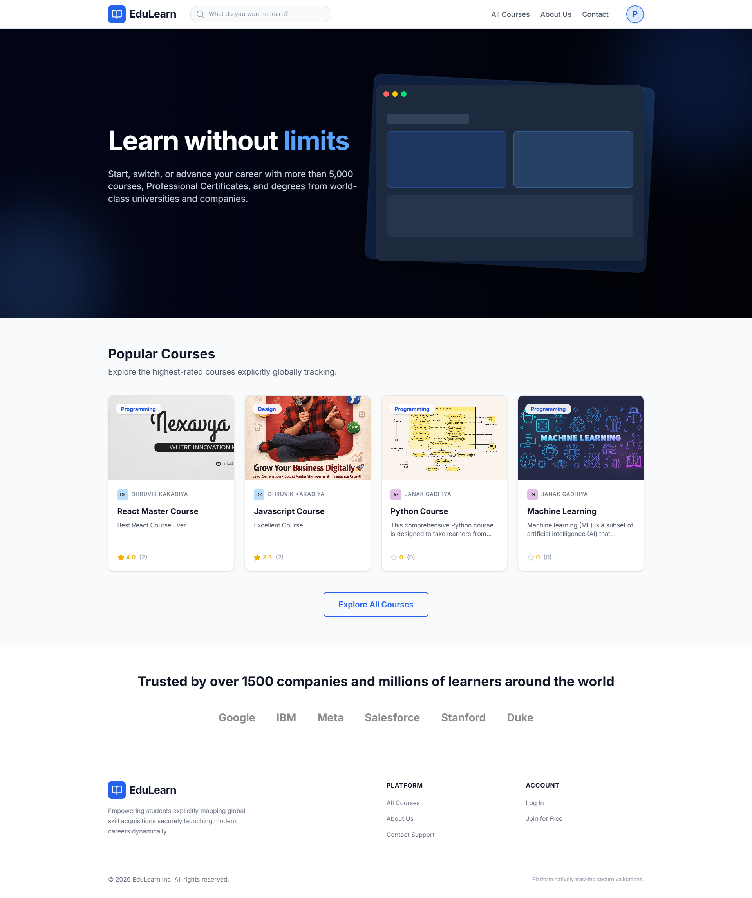
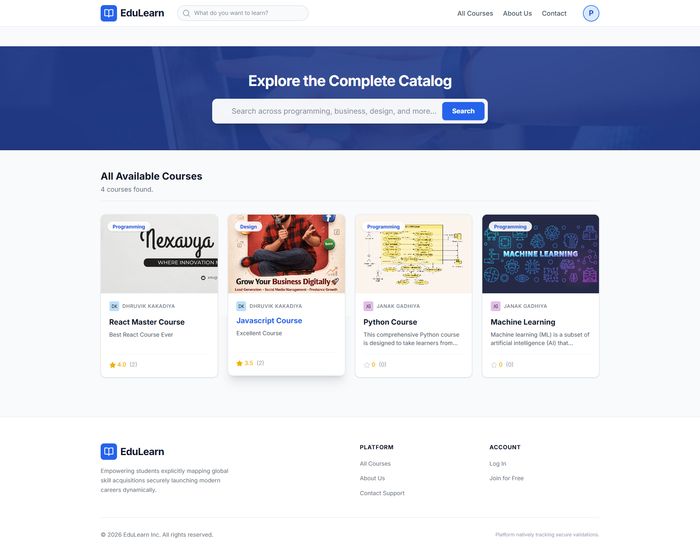
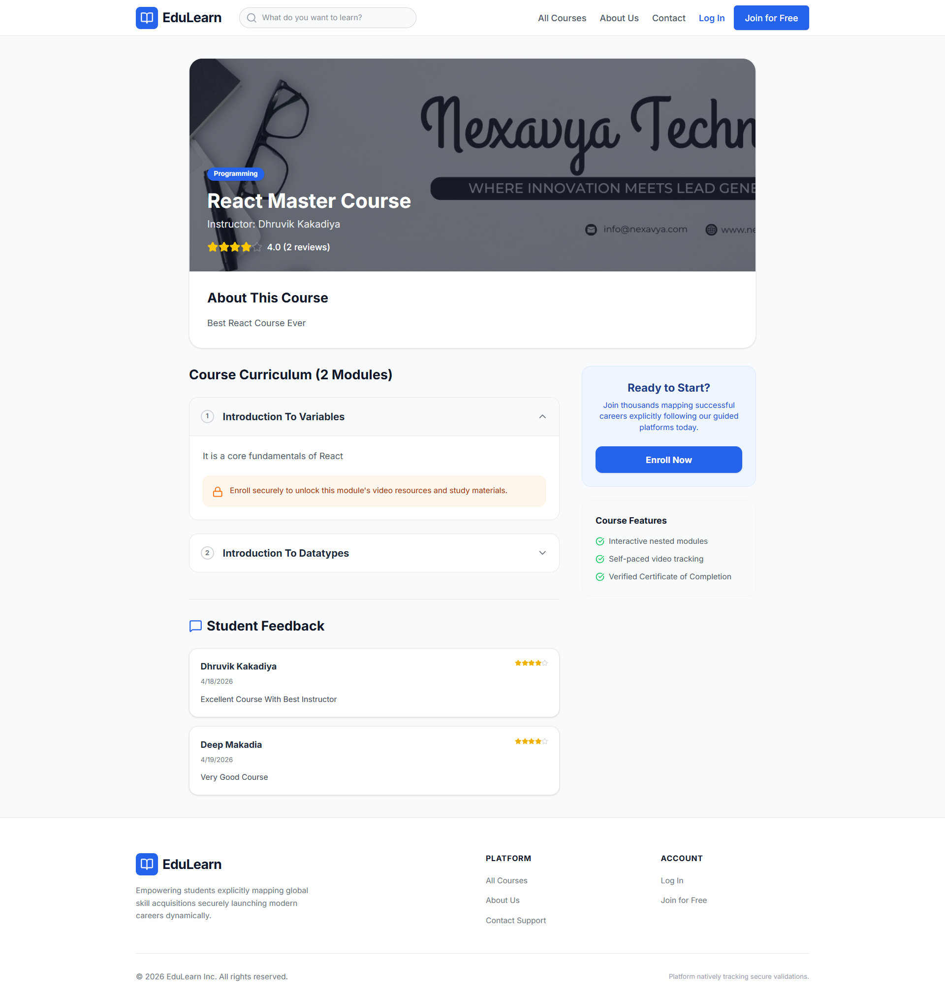
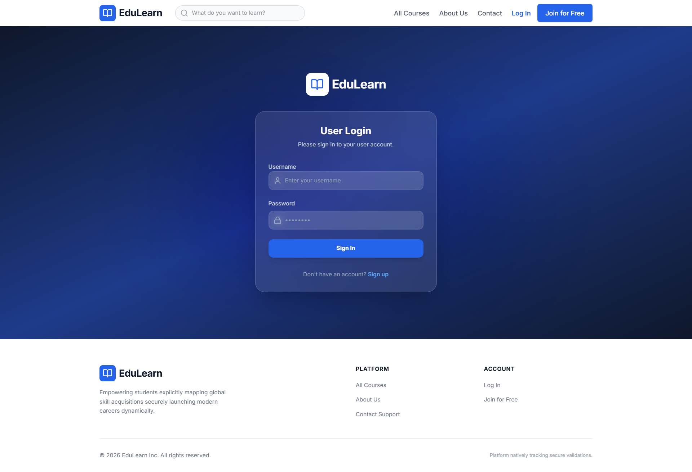
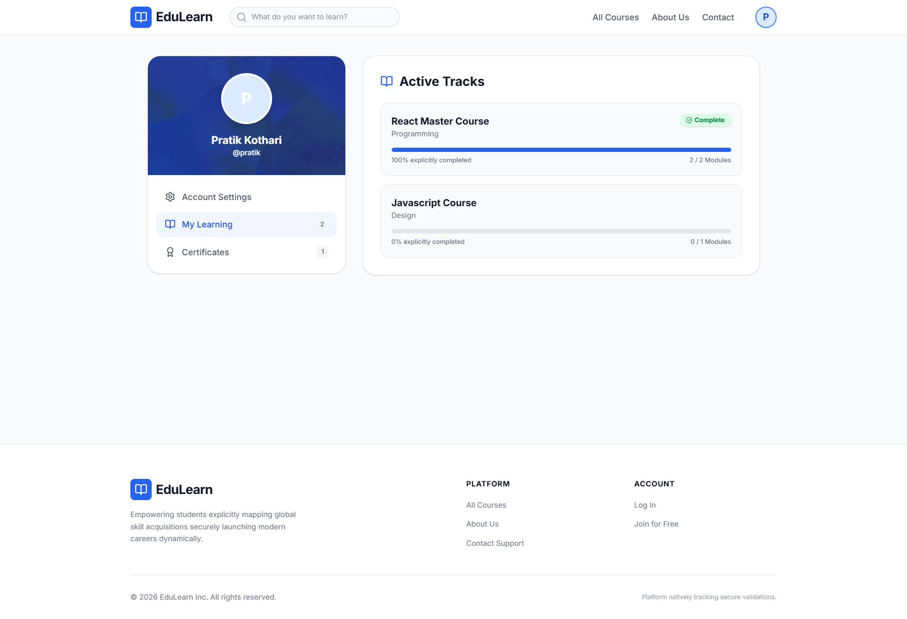
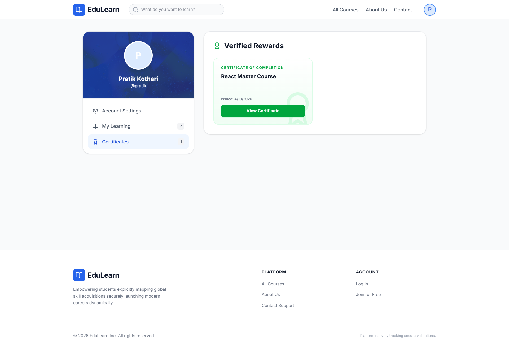
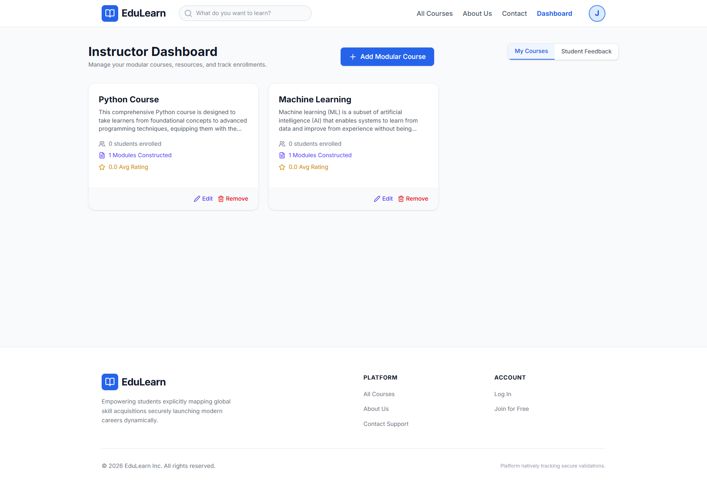
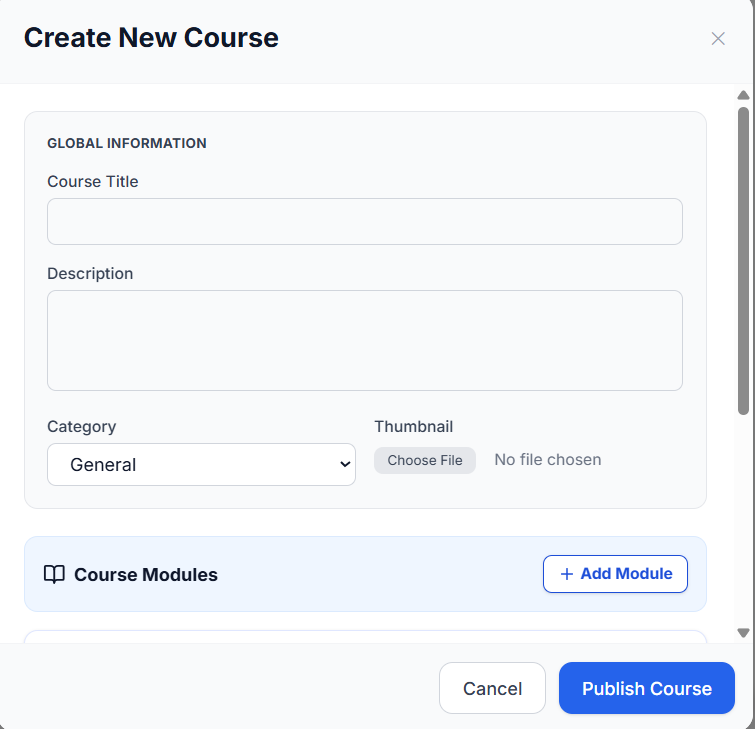
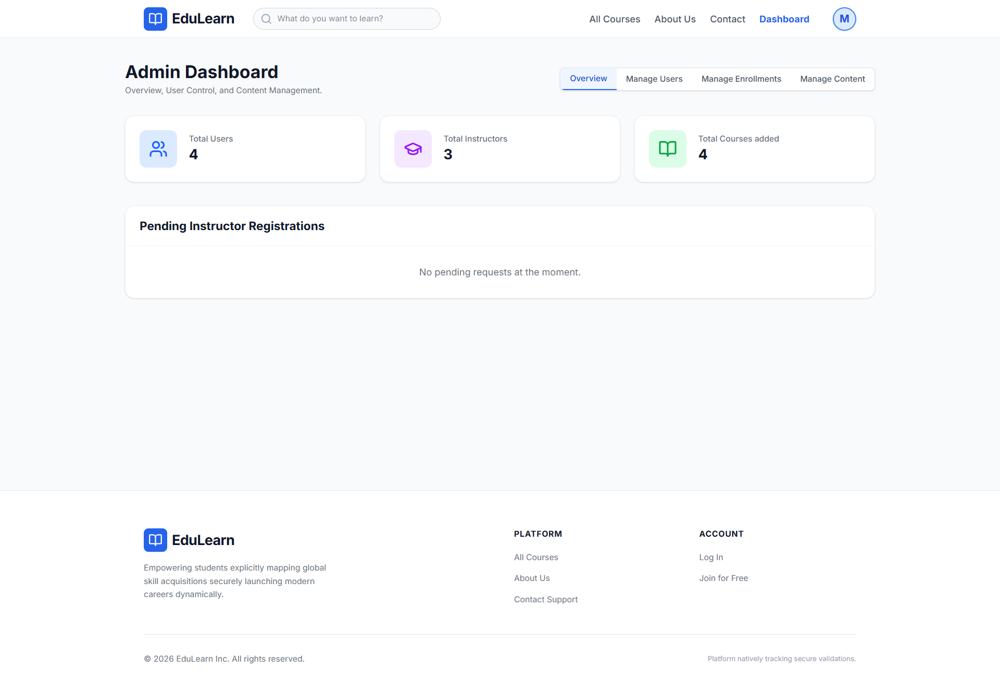
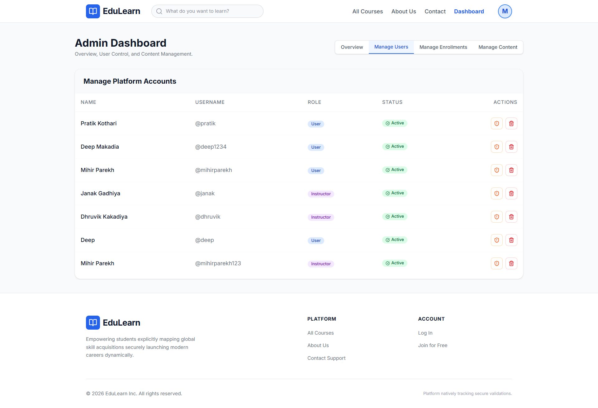

# 🎓 E-Learning Platform

A full-stack **Learning Management System (LMS)** built using the **MERN Stack** that enables students to enroll in courses, instructors to create and manage educational content, and administrators to oversee the platform through a secure role-based access control system.


---

# 📖 Project Overview

The E-Learning Platform is a role-based Learning Management System (LMS) designed to simulate a real-world online education platform.

The platform allows:

- 🎓 Students to browse and enroll in courses.
- 👨‍🏫 Instructors to create and manage educational content.
- 🛡️ Administrators to manage users and oversee the platform.

The project focuses on building a production-like application with secure authentication, authorization, RESTful APIs, and structured backend architecture.

---

# ✨ Features

## 🔐 Authentication

- User Registration
- Secure Login
- JWT Authentication
- Password Hashing using Bcrypt
- Protected Routes

### 🎓 Student Features

- Create an account
- Browse available courses
- Enroll in courses
- Track learning progress
- Submit ratings and reviews after course completion

### 👨‍🏫 Instructor Features

- Register as an Instructor
- Wait for Admin approval
- Create and manage courses
- Upload learning materials and video links
- View enrolled students

### 🛡️ Admin Features

- Approve or reject instructor registrations
- Manage platform users
- Block users when necessary
- View all courses
- Monitor platform activities

---

# 🏗️ System Architecture

```text
                React.js Frontend
                        │
                 REST API Calls
                        │
                        ▼
          Node.js + Express.js Backend
                        │
            JWT Authentication Middleware
                        │
                        ▼
          MongoDB Database (Mongoose)
```

The application follows a layered architecture where React handles the user interface, Express provides REST APIs, JWT secures authenticated requests, and MongoDB stores application data.

---

# 🛠️ Tech Stack

| Category | Technology |
|----------|------------|
| Frontend | React.js, Tailwind CSS |
| Backend | Node.js, Express.js |
| Database | MongoDB, Mongoose |
| Authentication | JWT, Bcrypt |
| API Testing | Postman |
| Version Control | Git & GitHub |

---

# 🧠 Core Concepts Implemented

- JWT Authentication
- Role-Based Access Control (RBAC)
- RESTful API Development
- Password Hashing using Bcrypt
- Protected Routes
- CRUD Operations
- Middleware-Based Authorization
- MongoDB Data Modeling
- Frontend & Backend Integration

---

# 📸 Application Preview

The following screenshots highlight the key features and workflows of the E-Learning Platform.

## 🌐 Public Pages

| Homepage | All Courses |
|-----------|-------------|
|  |  |

| Course Details |
|----------------|
|  |

---

## 👤 Student Portal

| Login | My Learnings |
|--------|--------------|
|  |  |

| Certificates |
|--------------|
|  |

---

## 👨‍🏫 Instructor Portal

| Dashboard | Add Course |
|-----------|------------|
|  |  |

---

## 🛡️ Admin Portal

| Dashboard | Manage Users |
|-----------|--------------|
|  |  |

---

# ✅ Prerequisites

Before running this project, ensure you have installed:

- Node.js (v18 or above recommended)
- npm
- Git
- MongoDB (Local or MongoDB Atlas)

---

# 🚀 Installation

## 1. Clone the Repository

```bash
git clone https://github.com/pratik-kothari-dev/e-learning-platform.git
```

## 2. Navigate to the Project

```bash
cd e-learning-platform
```

## 3. Install Backend Dependencies

```bash
cd backend
npm install
```

## 4. Start the Backend Server

```bash
nodemon server.js
```

## 5. Install Frontend Dependencies

```bash
cd ../frontend
npm install
```

## 6. Start the Frontend

```bash
npm run dev
```

---

# 🔐 Environment Variables

Create a `.env` file inside the `backend` directory.

```env
MONGO_URI=your_mongodb_connection_string
JWT_SECRET=your_secret_key
PORT=5000
```

Refer to the `.env.example` file for reference.

---

# 🎯 Key Learnings

Building this project helped me gain hands-on experience with:

- Designing RESTful APIs
- Implementing JWT Authentication & RBAC
- Structuring scalable MERN applications
- Managing MongoDB schemas with Mongoose
- Integrating React frontend with Express backend

---

# 👥 Contributors

This project was collaboratively developed as part of our MCA academic journey.

## Pratik Kothari

- GitHub: https://github.com/pratik-kothari-dev
- LinkedIn: https://linkedin.com/in/pratik-kothari-dev

---

## Mihir Joshi

- GitHub: https://github.com/mihir-joshii
- LinkedIn: https://linkedin.com/in/mihirjoshi-mern-dev

---


⭐ If you found this project useful, consider giving it a **Star** on GitHub!
